# Для удобства использовал подключение через SSH

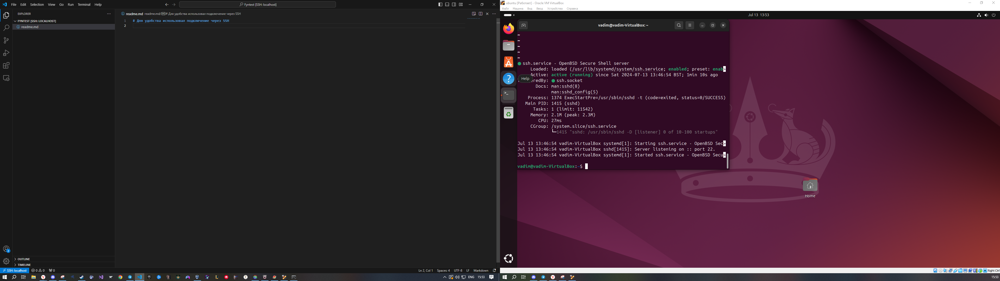

# Задание

## Задание 1

Создаём два файла:

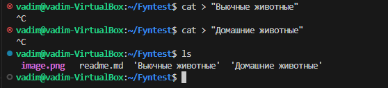

Далее заполняем эти два файла случайными животными(можно через cat в терминале, но поскольку есть ssh удобнее через vscode):

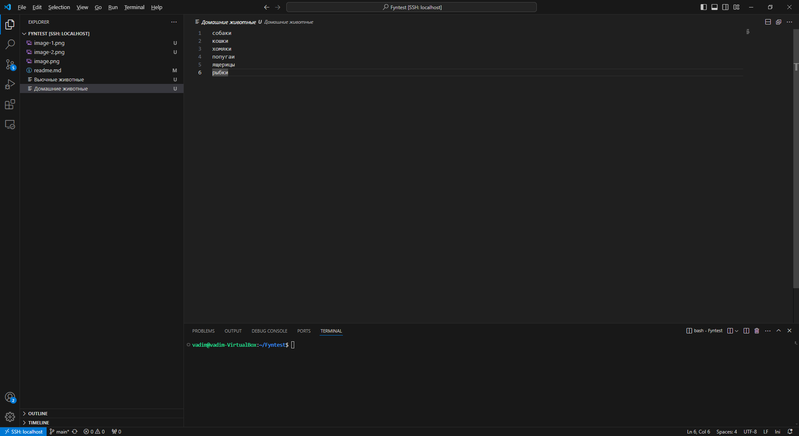

Теперь объединяем два файла в один:

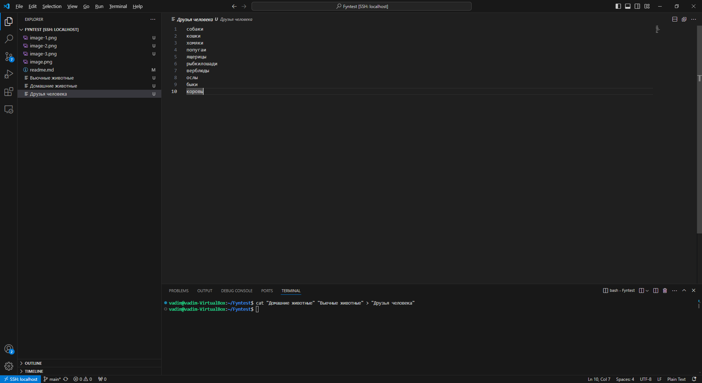

Если смотреть содержимое в терминале: 

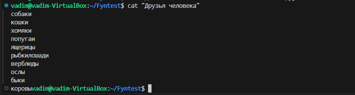

Переименование через терминал:

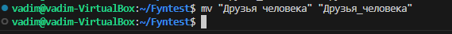

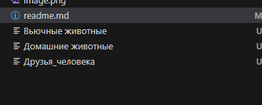

## Задание 2

Создаём дерикторию и перемещаем файл туда:

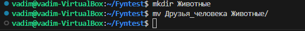

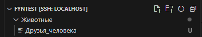

Если необходимо, проверка через терминал:

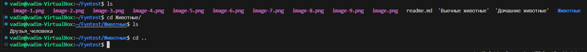

## Задание 3

Поскольку на Linux у меня не было ничего из SQL поставлю всё с нуля:

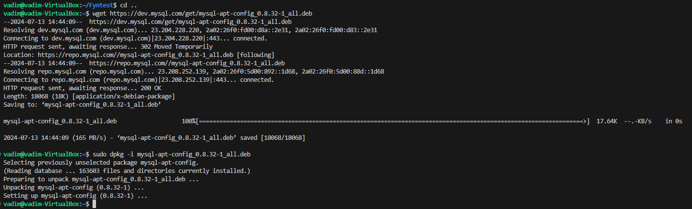

Теперь ставим сам MySQL из репо, добавленного в apt

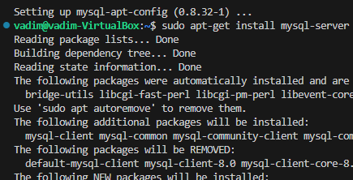

Думаю весь процесс загрузки вставлять не нужно, оставил конец:

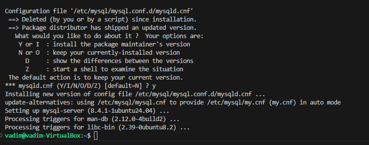

Проверяем статус: 

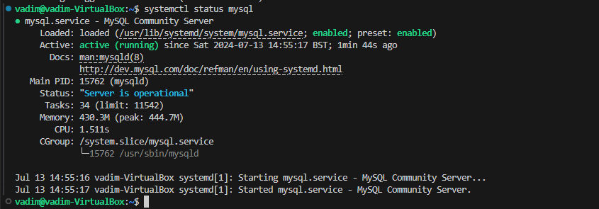

## Задание 4

Насколько я понимаю оно и так выполнено в задании 3, осталось только удалить пакет:

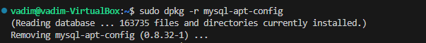

Теперь проверим грепом что пакета не осталось:

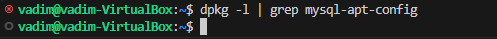

## Задание 5 

Историю команд сохранил в файл, однако там не только финальные команды попавшие в отчёт, но и неудоачные попытки (были проблемы с некоторыми репозиториями).

Так же там сохранилась история с прошлых заданий, история для текущего задания начинается со строки 199-200.

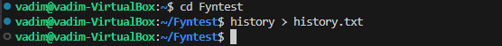

## Задание 6

Для диаграммы использовал draw.io, чтобы не захламлять сократил кол-во представителей классов до необходимого в задании 

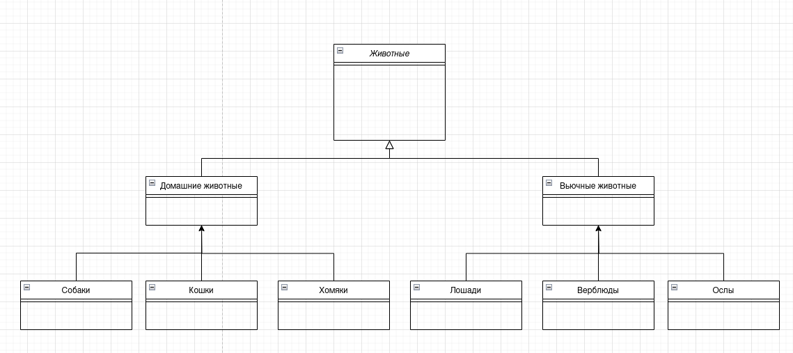

## Задание 7 

Захожу в MySQL под рутом и создаю базу:

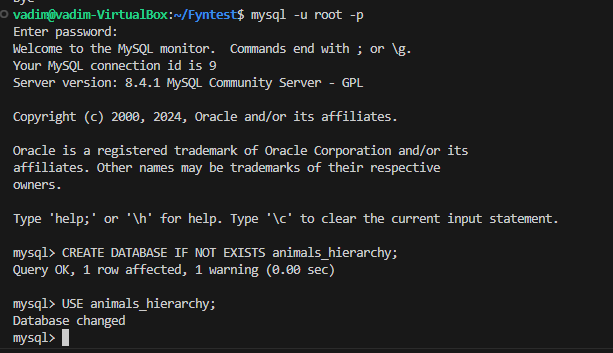

## Задание 8

Создаём таблицы в соответсвии с иерархией

Для всех животных: 

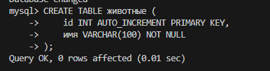

Для дочерних:

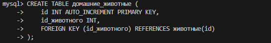

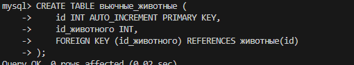

Для Конкретных видов:

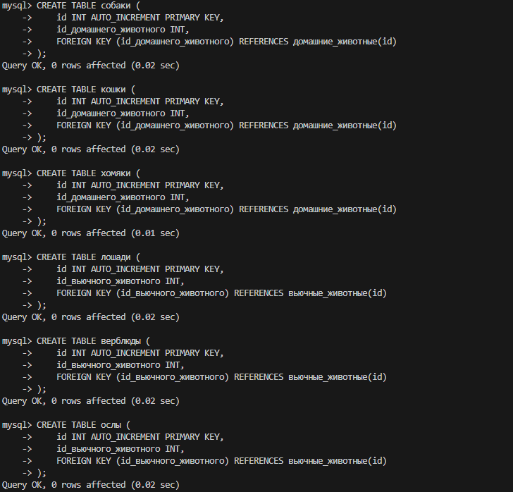

### На всякий случай описание таблиц:

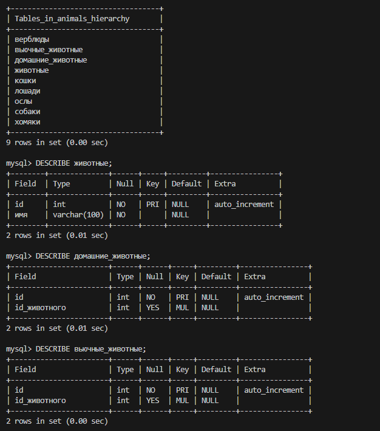

