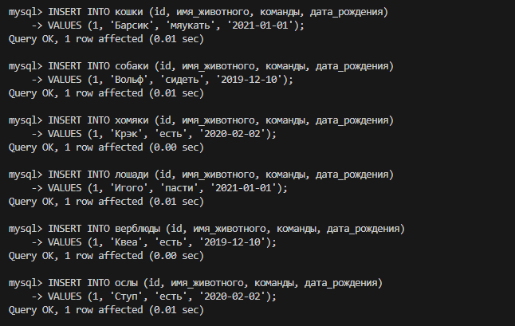
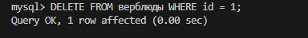
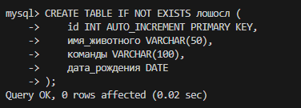
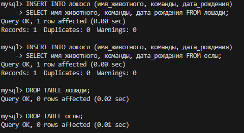
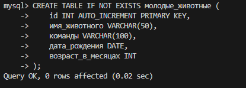
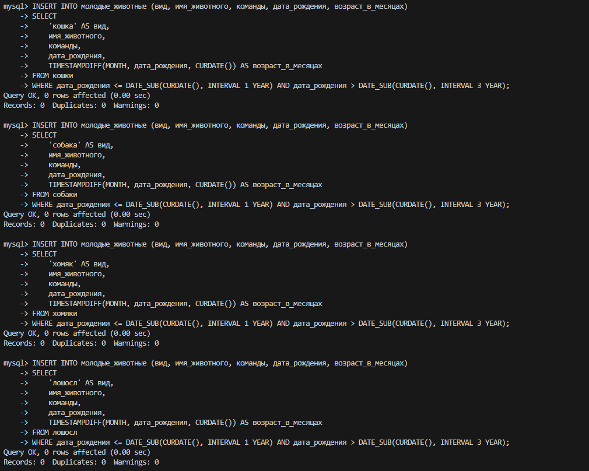
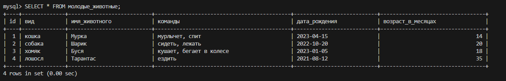
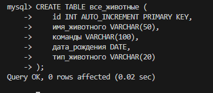
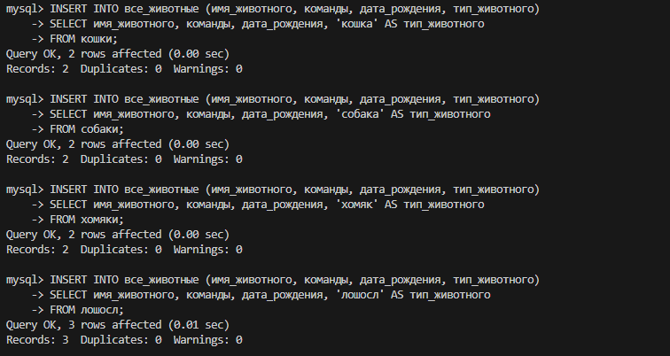
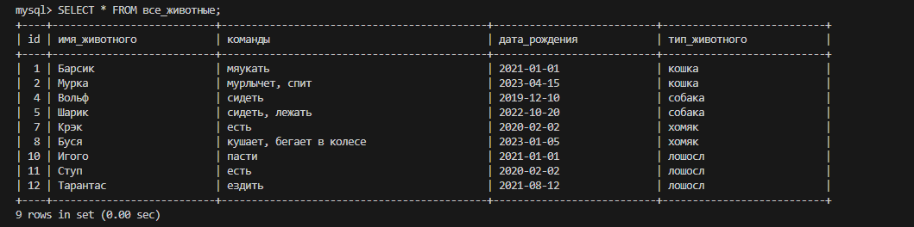

# Для удобства использовал подключение через SSH

# Задание

## Задание 1

Создаём два файла:

Далее заполняем эти два файла случайными животными(можно через cat в терминале, но поскольку есть ssh удобнее через vscode):

Теперь объединяем два файла в один:

Если смотреть содержимое в терминале: 

Переименование через терминал:

## Задание 2

Создаём дерикторию и перемещаем файл туда:

Если необходимо, проверка через терминал:

## Задание 3

Поскольку на Linux у меня не было ничего из SQL поставлю всё с нуля:

Теперь ставим сам MySQL из репо, добавленного в apt

Думаю весь процесс загрузки вставлять не нужно, оставил конец:

Проверяем статус: 

## Задание 4

Насколько я понимаю оно и так выполнено в задании 3, осталось только удалить пакет:

Теперь проверим грепом что пакета не осталось:

## Задание 5 

Историю команд сохранил в файл, однако там не только финальные команды попавшие в отчёт, но и неудачные попытки (были проблемы с некоторыми репозиториями).

Так же там сохранилась история с прошлых заданий, история для текущего задания начинается со строки 199-200.

## Задание 6

Для диаграммы использовал draw.io, чтобы не захламлять сократил кол-во представителей классов до необходимого в задании 

## Задание 7 

Захожу в MySQL под рутом и создаю базу:

## Задание 8

Создаём таблицы в соответсвии с иерархией

Для всех животных: 

Для дочерних:

Для Конкретных видов:

### На всякий случай описание таблиц:

## Задание 9 

Создаем столбцы под данные в низших таблицах:

Теперь заполняем столбцы:

## Задание 10

Удаляем верблюдов(как я понимаю именно конкретного верблюда а не таблицу целиком):

Создаём таблицу под объединение лошадей и ослов:

Теперь вставляем данные из таблиц, затем удаляем их

## Задание 11

Создаем таблицу молодые_животные:

Вносим всех попавших(перед этим специально добавил животных подходящих под условия):

Результат:

## Задание 12

Создаём таблицу для объединения

Переносим данные из старых таблиц:

Результат:

## Задание 13-15 

В файле AnimalReg.py.